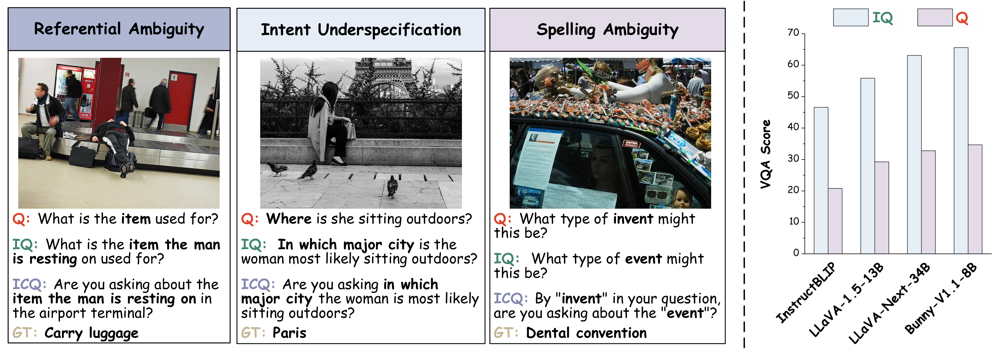

# ClearVQA

The official released dataset of "Teaching Vision-Language Models to Ask: Resolving Ambiguity in Visual Questions" can be found [here](https://huggingface.co/datasets/jian0418/ClearVQA). 

ClearVQA is a dataset emphasizes that for ambiguous visual questions, visual language modes should ask clarification questions based on given images, and generate desired answers in an interactive dialogue using user feedback.  Ambiguity in ClearVQA is categorized into three types: referential ambiguity, intent underspecification, and spelling ambiguity.  Existing VLMs typically struggle to handle the corresponding ambiguous question, leading to a significant drop in VQA accuracy. 

## Training 

To support the training of vision-language models (VLMs) with interactive clarification capabilities  in VQA tasks, we construct and release a dedicated training dataset, and recommend using the *[LLaMA-Factory](https://github.com/hiyouga/LLaMA-Factory)* repository as an efficient training framework.

## Data Construction

As described in the paper *"Teaching Vision-Language Models to Ask: Resolving Ambiguity in Visual Questions"*, to further enhance the interactive disambiguation capabilities of VLMs in VQA tasks, you may also automatically construct training data based on clearly stated original visual questions. The specific prompts are provided in `./prompts/`.